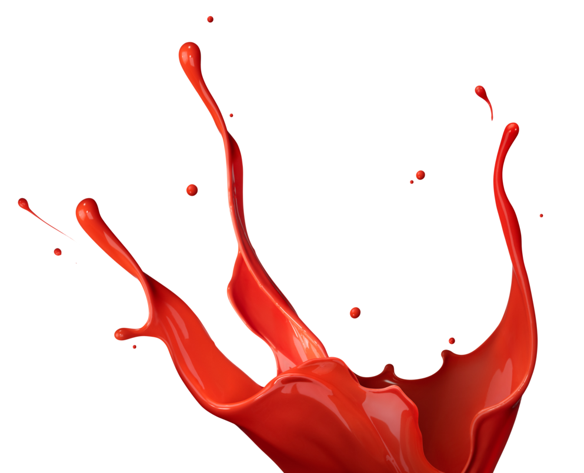

BEBE SANGRE HUMANA
====================

:date: 2013-04-13
:tags: thats, awesome
:category: yeah
:slug: my-super-post-1
:author: Idoia

**Michelle** de 29 años, **sufre una extraña adicción que le impulsa a beber sangre**. Descubierta por el programa My Strange Adicction, Michelle la sangre que toma es normalmente de animales como el cerdo, pero ella prefiere succionar la sangre humana.

Algunos de sus amigos se prestan a que la joven les chupe algo de su sangre, pero es casi imposible saciar su sed.

Algunos definirían a esta californiana de 29 años, como una auténtica vampira, pero a ella no le gusta que le denominen así. Michelle asegura que simplemente disfruta bebiendo sangre pero reconoce que es difícil de entender por el resto de los humanos.

Como asegura el diario Huffingtonpost, la tatuadora comenzó a beber sangre cuando era solo una adolescente, pero su sed ha ido creciendo cada vez más. Bebe unos 36 litros de sangre de cerdo a la semana, pero su bebida preferida es la sangre humana, que la ingiere una vez a la semana. Gracias a un amigo suyo, todas las semanas Michelle succiona directamente del brazo de su compañero su bebida preferida.

La joven californiana asegura que siempre bebe sangre humana de alguien al que conoce muy bien, porque existe un gran riesgo de contraer enfermedades como la hepatitis o el VIH.

